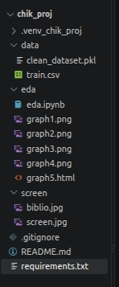
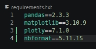

# Лабораторная работа №1 - Настройка окружения и разведочный анализ данных

## Описание проекта

Проект посвящен первичному развертыванию рабочего окружения и проведению разведочного анализа данных (на наборе данных Mobile Price Classifications - https://www.kaggle.com/datasets/iabhishekofficial/mobile-price-classification?resource=download)

Цель - классификация смартфонов по 4 ценовым категорям на основе аппаратных характеристик

# Запуск - Как запустить проект

## Инструкция по развертыванию проекта на новой машине

### 1) Клонирование 

Перешел в корневую директорию проекта (либо создал командой **mkdir**) и клонировал проект из удаленного репозитория в VS Code с помощью команды:

**git clone https://github.com/wwwmctss/PROJ1.git**

Из папки PROJ1 перенес файлы в корневую папку.

### 2) Настройка виртуального окружения

Создал изолированное виртуальное окружение Python в корне проекта и активировал его:

**python -m venv .venv_chik_proj**

**source .venv_chik_proj/bin/activate**

### 3) Установка зависимостей

Обновил пакетный менеджер pip и установил все требуемые библиотеки, которые записаны в requirements.txt:

**pip install --upgrade pip**

**pip install -r requirements.txt**

### 4) Подготовка данных

- Убедился в наличии директории data/ (либо создал ее командой **mkdir data**)

- Поместил исходный обучающий файл с Kaggle (train.csv) в папку data/

### 5) Запуск

- Открыл интерактивный блокнот eda/eda.ipynb

- В правом верхнем углу интерфейса редактора выбрал ядро .venv_chik_proj

- Последовательно выполнил все ячейки блокнота

## Описание модулей проекта и результаты EDA

### Структура проекта

В .gitignore зафиксировано то, что мы не коммитим (*.csv, *.pkl, .venv*).

screen/ - скриншоты, используемые в README.md.

clean_dataset.pkl - очищенный датасет.

### Используемые библиотеки

### Результаты разведочного анализа данных

1. Данные + очистка:

- Количество строк и столбцов: 2000 x 21. Все данные числовые (int64, float64), пропуски и дубликаты отсутствуют.

- Обнаружены некорректные, с точки зрения физических свойств объекта, нулевые значения в столбцах ширины экрана (sc_w) и вертикального разрешения экрана в пикселях (px_height). Нули заменены на медианные значения соответствующих колонок.

2. Создание нового признака:

- screen_area: физическая площадь дисплея в квадртаных сантиметрах (sc_h * sc_w).

3. Ключевые закономерности и выводы:

- Баланс классов: Выборка идеально сбалансирована — на каждый из 4 ценовых классов приходится ровно по 500 записей (25%).

- Доминирующий признак: Объем оперативной памяти (ram) является главным разделяющим фактором для классификации. Между классами практически нет пересечений по квартилям: бюджетные модели имеют RAM до 1500 Мб, флагманы - выше 3000 Мб.

- Вторичные признаки: Емкость аккумулятора (battery_power) и площадь экрана (screen_area) показывают умеренную положительную связь с целевым классом — чем выше ценовая категория, тем выше медианные значения параметров.

- Интерактивный анализ: График graph5.html подтверждает независимость распределения RAM от батареи: даже при слабом аккумуляторе телефоны с большим объемом оперативной памяти уверенно относятся к старшей ценовой категории.

## Финальные команды для сохранения файлов проекта

Убеждаемся что данные не коммитятся:

git status

Фиксируем и отправляем изменения на GitHub:

git add README.md eda/ requirements.txt screen/

git commit -m "..."

git push origin main